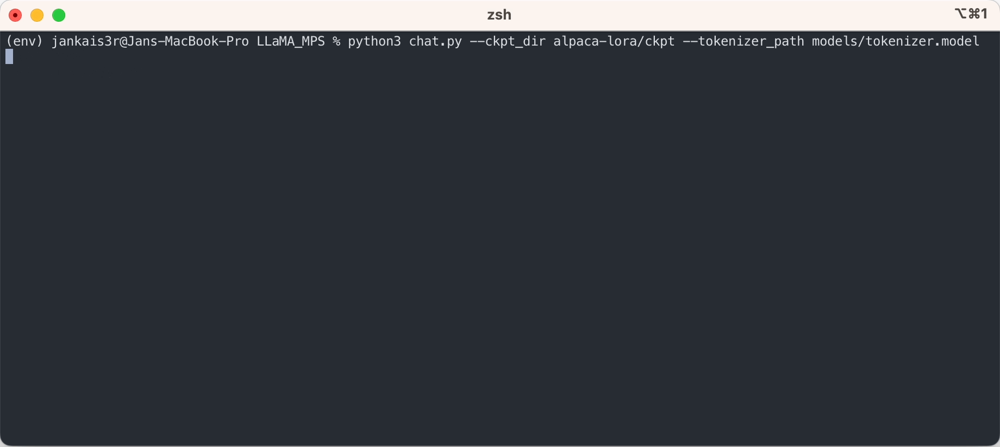

# LLaMA_MPS
Run LLaMA (and Stanford-Alpaca) inference on Apple Silicon GPUs.


As you can see, unlike other LLMs, LLaMA is not biased in any way 😄

### Initial setup steps

**1. Clone this repo**

`git clone https://github.com/jankais3r/LLaMA_MPS`

**2. Install Python dependencies**

```bash
cd LLaMA_MPS
pip3 install virtualenv
python3 -m venv env
source env/bin/activate
pip3 install -r requirements.txt
pip3 install -e .
```

### LLaMA-specific setup

**3. [Download the model weights](https://github.com/facebookresearch/llama/pull/73/files#diff-b335630551682c19a781afebcf4d07bf978fb1f8ac04c6bf87428ed5106870f5R4) and put them into a folder called** `models` (e.g., `LLaMA_MPS/models/7B`)

**4. _(Optional)_ Reshard the model weights (13B/30B/65B)**

Since we are running the inference on a single GPU, we need to merge the larger models' weights into a single file.

```bash
mv models/13B models/13B_orig
mkdir models/13B
python3 reshard.py 1 models/13B_orig models/13B
```

**5. Run the LLaMA inference**

`python3 chat.py --ckpt_dir models/13B --tokenizer_path models/tokenizer.model --max_batch_size 8 --max_seq_len 256`

The above steps will let you run inference on the raw LLaMA model in an 'auto-complete' mode.

If you would like to try the 'instruction-response' mode similar to ChatGPT using the fine-tuned weights of [Stanford Alpaca](https://github.com/tatsu-lab/stanford_alpaca), continue the setup with the following steps:

### Alpaca-specific setup



<<<<<<< HEAD
**3. Download the fine-tuned weights (available for 7B/13B)**
=======
The above steps will let you run inference on the raw LLaMA model in an 'auto-complete' mode.

If you would like to try the 'instruction-response' mode using the fine-tuned weights of [Stanford Alpaca](https://github.com/tatsu-lab/stanford_alpaca), continue the setup with the following steps:

**6. Clone the alpaca-lora repo**

`git clone https://github.com/tloen/alpaca-lora`

**7. Download the fine-tuned weights**
>>>>>>> fdf4c78fd77d35f4dd026e1ae1698d51cabd4106

```bash
python3 export_state_dict_checkpoint.py 7B
python3 clean_hf_cache.py
```

<<<<<<< HEAD
**4. Run the inference**
=======
**8. Run the Alpaca inference**
>>>>>>> fdf4c78fd77d35f4dd026e1ae1698d51cabd4106

`python3 chat.py --ckpt_dir models/7B-alpaca --tokenizer_path models/tokenizer.model --max_batch_size 8 --max_seq_len 256`

### Memory requirements

| Model | Starting memory during inference | Peak memory during checkpoint conversion | Peak memory during resharding |
| ------------- | ------------- | ------------- | ------------- |
| 7B | 16 GB | 14 GB | N/A |
| 13B | 32 GB | 37 GB | 45 GB |
| 30B | 66 GB | 76 GB | 125 GB |
| 65B | ?? GB | ?? GB | ?? GB |

**Min specs per model (slow due to swapping):**

* 7B - 16 GB RAM
* 13B - 32 GB RAM
* 30B - 64 GB RAM
* 65B - needs testing

**Recommended specs per model:**

* 7B - 24 GB RAM
* 13B - 48 GB RAM
* 30B - 96 GB RAM
* 65B - needs testing

### Parameters to experiment with
**- max_batch_size**

If you have spare memory (e.g., when running the 13B model on a 64 GB Mac), you can increase the batch size by using the `--max_batch_size=32` argument. Default value is `1`.

**- max_seq_len**

To increase/decrease the maximum length of generated text, use the `--max_seq_len=256` argument. Default value is `512`.

**- use_repetition_penalty**

The example script penalizes the model for generating a repetitive content. This should lead to higher quality output, but it slightly slows down the inference. Run the script with `--use_repetition_penalty=False` argument to disable the penalty algorithm.

### Alternatives

The best alternative to LLaMA_MPS for Apple Silicon users is [llama.cpp](https://github.com/ggerganov/llama.cpp), which is a C/C++ re-implementation that runs the inference purely on the CPU part of the SoC. Because compiled C code is so much faster than Python, it can actually beat this MPS implementation in speed, however at the cost of much worse power and heat efficiency.

See the below comparison when deciding which implementation better fits your use case.

| Implementation | Total run time - 256 tokens | Tokens/s | Peak memory use | Peak SoC temperature | Peak SoC Power consumption | Tokens per 1 Wh |
| -------------- | ------------------------------- | ----------------------------- | ------------- | ------------------------- | ------------------------------ | --------------------------- |
| LLAMA_MPS (13B fp16) | 75 s | 3.41 | 30 GB | 79 °C | 10 W | 1,228.80 |
| llama.cpp (13B fp16) | 70 s | 3.66 | 25 GB | 106 °C | 35 W | 376.16 |

### Credits

- facebookresearch ([original code](https://github.com/facebookresearch/llama))
- markasoftware ([cpu optimizations](https://github.com/markasoftware/llama-cpu))
- remixer-dec ([mps optimizations](https://github.com/remixer-dec/llama-mps))
- venuatu ([continuous token printing](https://github.com/venuatu/llama/commit/25c84973f71877677547453dab77eeaea9a86376) / [loading optimizations](https://github.com/venuatu/llama/commit/0d2bb5a552114b69db588175edd3e55303f029be))
- benob ([reshard script](https://gist.github.com/benob/4850a0210b01672175942203aa36d300))
- tloen ([repetition penalty](https://github.com/tloen/llama-int8) / [LoRA merge script](https://github.com/tloen/alpaca-lora/blob/main/export_state_dict_checkpoint.py))
